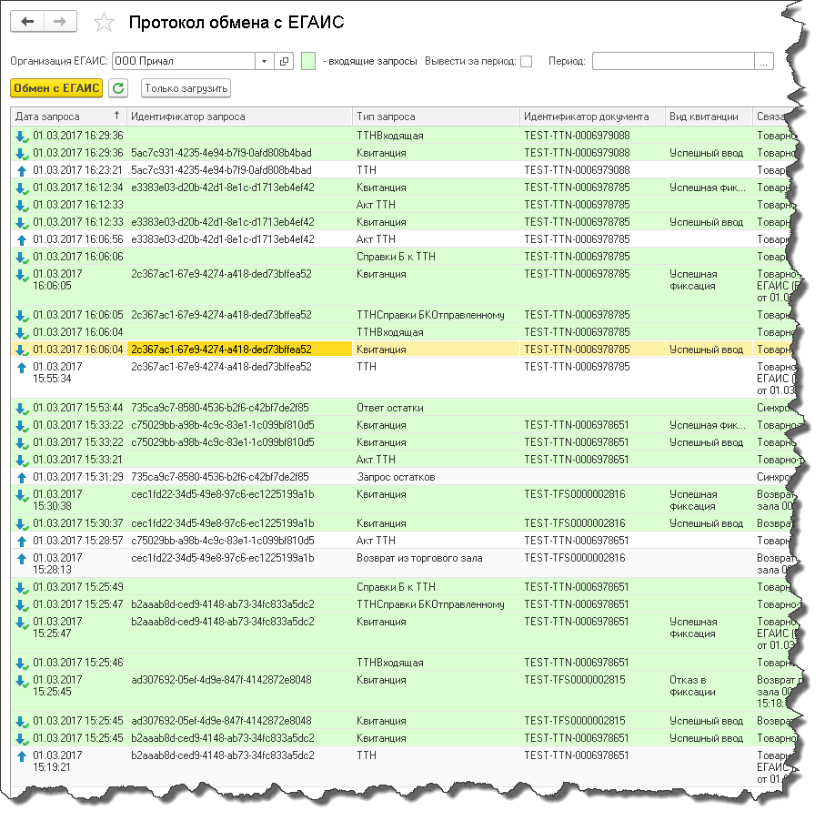

Протокол обмена ЕГАИС
=====================

Вся работа с ЕГАИС ведётся через протокол обмена.

В нем находится вся информация об исходящих и входящих запросах ЕГАИС по выбранной организации.
По кнопке "Обмен с ЕГАИС" загружаются входящие запросы из УТМ и записываются в протокол, после чего необработанные ответы из протокола сразу же обрабатываются.

Зеленым цветом выделены входящие запросы. 

.. hint:: Также есть возможность ограничить список запросов по выбранному периоду. Если не поставлена галочка `Вывести за период`, то будут показаны все запросы , если галочка стоит, будут показаны только те запросы, которые входят в выбранный вами период.