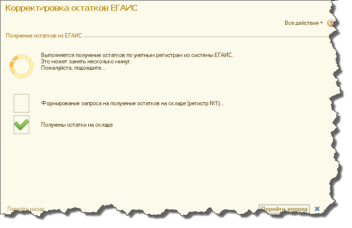

Корректировка остатков ЕГАИС
============================

Обработка используется для синхронизации остатков между информационной базой и ЕГАИС с учетом остатков в обоих регистрах (оптовом и розничном). Сначала загружаются остатки ЕГАИС, сравниваются с текущими остатками из ИБ, и на основе этих несоответствий создаются документы, после отправки которых вы скорректируете в ЕГАИС информацию по текущим остаткам из информационной базы.

В обработке действует пошаговый интерфейс, вы постранично вводите нужную обработке информацию.

.. figure:: _static/korost01.png

На первой странице вы выбираете организацию. Также вы можете выбрать группу номенклатуры, которую будете синхронизировать, если включите галочку "Отбирать по группам", тогда будет видно поле "Группа номенклатуры", в котором вы можете выбрать нужную группу из справочника "Номенклатура". При выключенной галочке будет выбрана вся алкогольная продукция. 
Переключатель "Все, Маркируемые, Немаркируемые" отберёт эту номенклатуру по кодам вида продукции. То есть, если вы выберете, например, "Немаркируемые", тогда будет отбираться только номенклатура с кодами 261, 262, 263, 500, 510, 520. При положении переключателя "Маркируемые" будет отбираться номенклатура со всеми остальными кодами исключая перечисленные ранее.

При нажатии на кнопку "Перейти вперед" вы перейдете на страницу выбора актуальных остатков.

.. figure:: _static/korost02.png

Вы можете запросить остатки из ЕГАИС или выбрать из запрашиваемых ранее, используя документы "Синхронизация остатков ЕГАИС" и "Загрузка остатков из торгового зала".

Если хотя бы один переключатель установлен в положение "Запросить остатки ...", тогда после нажатия на кнопку "Перейти вперед" в ЕГАИС отправляется запрос. Убедитесь в правильности настроек УТМ для связи с ЕГАИС.

Обработка отправляет запрос и каждые 2 минуты после этого проверяет, не пришел ли ответ. Эта страница не показывается, если остатки из обоих регистров были выбраны из загруженных документов, так как остатки уже загружены и ожидание не требуется. Когда ответ приходит, на экран выводится следующая страница, уведомляющая о том, что остатки загружены и их можно посмотреть. 

.. figure:: _static/korost04.png

Теперь вы можете приступить к автоматическому созданию корректировочных документов нажатием кнопки "Перейти вперед".

.. figure:: _static/korost05.png

В таблицу корректировок, которая видна на экране, записываются сначала запрашиваемые остатки из ЕГАИС или из загруженных ранее документов (в зависимости от того, что вы до этого выбрали). После этого в эту таблицу добавляются остатки из информационной базы. Обратите внимание, что в таблицу могут вывестись номенклатура ЕГАИС, не сопоставленная с номенклатурой ИБ и наоборот, номенклатура из регистра "Остатки на складе", которой не соответствует ни одна из позиции номенклатуры ЕГАИС. Такая номенклатура попадает в данную таблицу, даже если она не попадает в отбор по выбранной номенклатурной группе - это сделано для того, чтобы не сопоставленная номенклатура была видна сразу. Вообще если есть несопоставленная номенклатура, остатки не смогут быть скорректированы правильно.

Колонки "Регистр1" и "Регистр2" заполняются по данным ЕГАИС, колонка "Остаток на складе" заполняется по данным информационной базы, остальные две колонки "Передать в торговый зал" и "Постановка / списание" заполняются из показателей остальных колонок и на их основе делаются корректировочные документы. В поле "Передать в торговый зал" просто передается показатель первого регистра из ЕГАИС. Поле "Постановка / списание" рассчитывается по формуле:

Постановка / списание = Остаток на складе - Регистр1 - Регистр2

Таким образом, если в таблице есть ненулевые показатели колонки "Постановка / списание", на основе этих показателей создается документ "Передача продукции в торговый зал ЕГАИС" с табличной частью "Товары", соответствующей этим показателям. На основе показателей колонки "Постановка / списание" создаются документы "Акт постановки на баланс в торговом зале ЕГАИС", если числовое значение положительное, или "Акт списания с баланса в торговом зале ЕГАИС", если числовой показатель отрицательный. Все эти документы сразу создадутся после нажатия кнопки "Перейти вперед".

.. figure:: _static/korost06.png

После того как документы созданы, вы можете их отправить в ЕГАИС для корректировки данных.