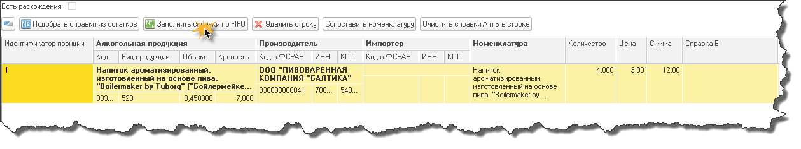
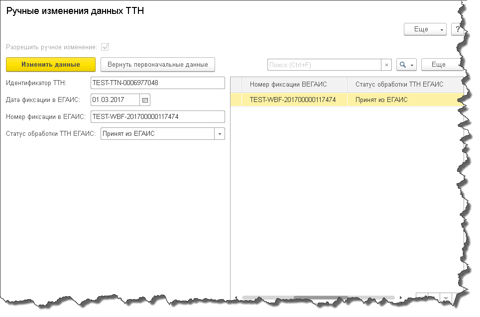
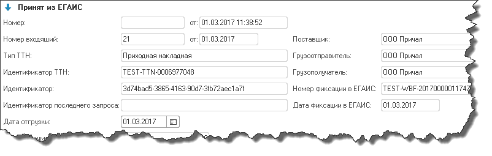

ТТН ЕГАИС
=========

Создание документа ТТН
----------------------

Документ ТТН можно создать на основании документов "Реализация товаров и услуг", "Возврат товаров поставщику" и "Перемещение товаров".
При нажатии кнопки "Создать" откроется форма выбора документа основания для новой ТТН.

.. figure:: _static/ttn11.png

После выбора документа откроется форма нового документа ТТН, заполненного на основании выбранного документа.

.. figure:: _static/ttn12.png

.. figure:: _static/ttn13.png

Для отправки ТТН в ЕГАИС нужно заполнить справки Б у каждой номенклатуры. Это можно сделать вручную, либо автоматически по FIFO.
При нажатии на кнопку "Заполнить справки по FIFO" справки подберутся автоматически.

.. figure:: _static/ttn15.png

При нажатии на кнопку "Подобрать справки из остатков" будет открыт список справок Б, в нем же показаны остатки выбранного товара по этим справкам.

.. figure:: _static/ttn16.png

.. figure:: _static/ttn17.png

Сопоставление номенклатуры по товарам из ТТН
--------------------------------------------

В табличной части "Товары" документа ТТН есть кнопка "Сопоставить номенклатуру".

.. figure:: _static/ttn01.png

При её нажатии появится окно списка номенклатуры ЕГАИС и ИБ. 

.. figure:: _static/ttn02.png

Если кнопка была нажата из входящего документа ТТН, то отбор по товарам из данной ТТН будет произведен в списке алкогольной продукции ЕГАИС, а если из исходящего, то в списке номенклатуры ИБ.

Выбор номенклатуры из множественного сопоставления
--------------------------------------------------

Если номенклатуре ЕГАИС, указанной в табличной части "Товары" входящей ТТН сопоставлено несколько номенклатур из ИБ, то вы можете выбрать одну из них.

.. figure:: _static/ttn03.png

Ручное изменение данных
-----------------------

Документ Товарно-транспортная накладная ЕГАИС в конфигурации существует для отражения состояния соответствующего документа в ЕГАИС. По результатам обмена с УТМ у документов меняется статус, присваивается номер идентификатора, номер и дата фиксации. Но в ряде случаев обмен может работать некорректно, (изменения могут не зафиксироваться например из-за плохого соединения, или неправильной работы УТМ) и если вы уверены что данные документа в вашей базе отличаются от данных того же документа в ЕГАИС, предусмотрена возможность изменить их самому, как бы вручную довести до актуальности.

.. figure:: _static/ttn04.png

Если бы пользователю была дана возможность редактировать данные свободно, без определенного алгоритма сохранения изменения данных, то ни у пользователей, ни у техподдержки не было бы уверенности в актуальности данных документов в базе. 
С помощью ручного изменения данных пользователи могут изменять статус обработки, идентификатор ТТН, дату и номер фиксации в ЕГАИС, однако каждое это изменение будет записываться в регистр Ручные изменения данных ТТН. При включении режима изменения в регистр записываются текущие данные ТТН. После этого их можно изменять, каждое изменение будет фиксироваться. В любой момент можно откатить все изменения вернув первоначальные данные.

.. warning:: Изменение данных в информационной базе не повлечет за собой изменение их в ЕГАИС.

.. figure:: _static/ttn05.png

Для возможности изменения данных вручную, нужно включить разрешение ручного изменения нажав на галочку "Разрешить ручное изменение". После положительного ответа на предупреждение, изменение станет доступным. Справа отображается список регистра Ручные изменения данных ТТН по текущей ТТН. Когда изменение станет доступным, в списке будет одна запись.

После заполнения данных вручную нажимайте кнопку "Изменить данные", окно закроется и изменения будут видны в документе.

.. figure:: _static/ttn07.png

.. figure:: _static/ttn08.png

Чтобы вернуться к первоначальным данным, которые были до ручного изменения нажмите кнопку "Вернуть первоначальные данные".

.. figure:: _static/ttn09.png

